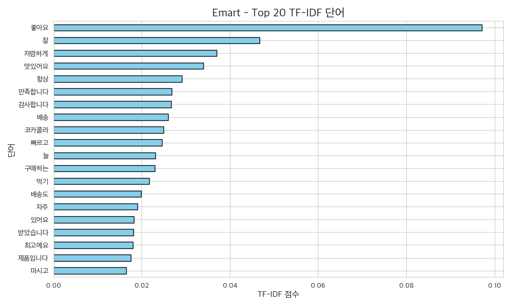
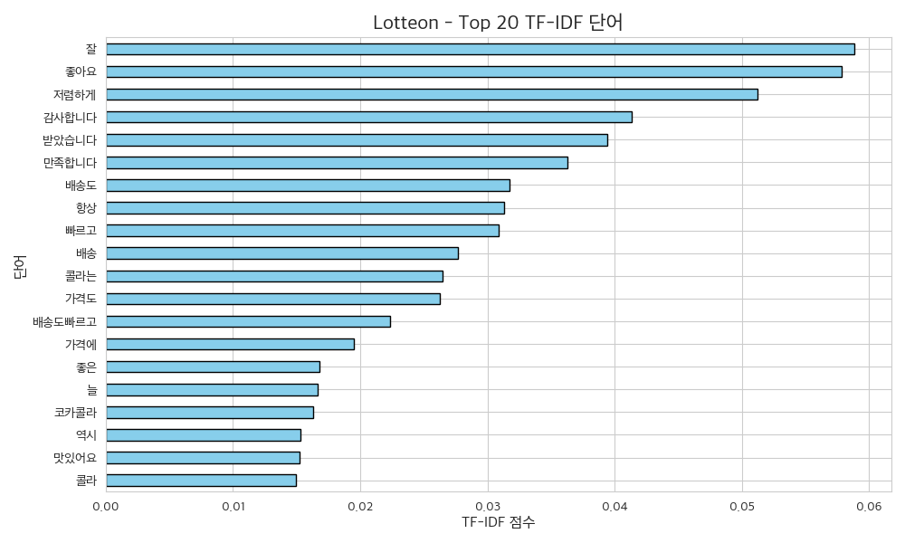
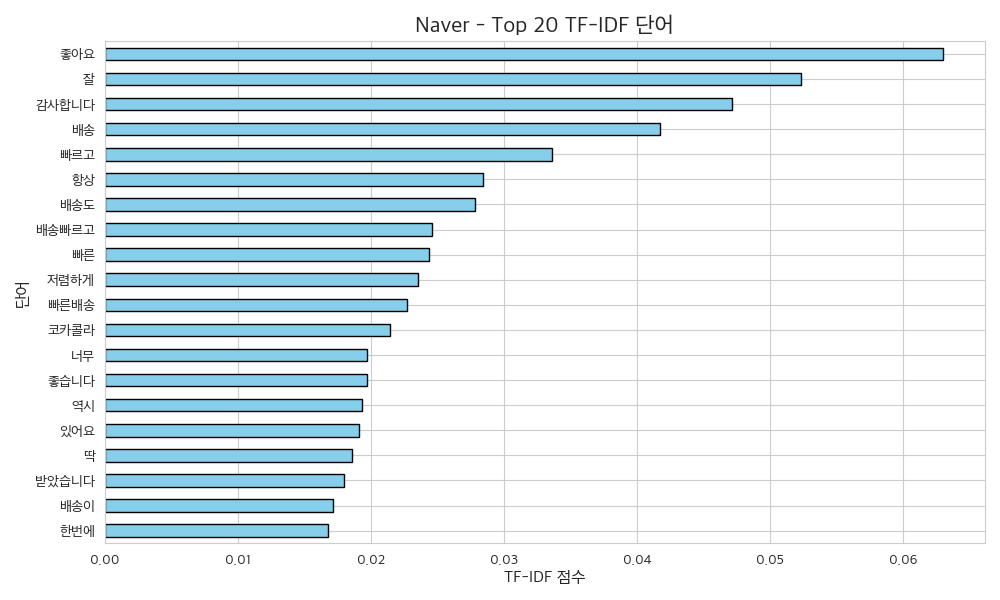

# 1. 크롤링

## LotteON 리뷰 크롤링

### 크롤링 대상 사이트
- [LotteON - 코카콜라 190ml 60캔 상품 페이지](https://www.lotteon.com/p/product/LD755546264)

### 크롤링한 데이터 형식
- 총 500개의 리뷰
- CSV 파일로 저장됨 (`reviews_lotteon.csv`)
- 열(column) 구성:
  - `date`: 리뷰 작성일 (문자열)
  - `star`: 별점 (실수형, 1.0 ~ 5.0)
  - `review`: 리뷰 본문 (문자열)


## Naver 리뷰 크롤링

### 크롤링 대상 사이트
- [네이버쇼핑 - 코카콜라 190ml 60캔 상품 페이지]("https://brand.naver.com/cocacola/products/4624572909")

### 크롤링한 데이터 형식
- 총 500개의 리뷰
  리뷰 한 페이지 당 20개 존재 -> 페이지를 넘기면서 크롤링 하다가 500개가 되는 때에 멈추도록 제한
- CSV 파일로 저장됨 (`reviews_naver.csv`)
- 열(column) 구성:
  - `별점`: 별점 (실수형, 1.0 ~ 5.0) : class "_15NU42F3kT"
  - `날짜`: 리뷰 작성일 (문자열),`리뷰`: 리뷰 본문 (문자열) : class "_2L3vDiadT9" 에 webelement 로 존재 
  -> "_2L3vDiadT9" 에 해당하는 web element를 text화 한 후 날짜 형식 (xx.xx.xx.)을 기준으로 list element 생성하여 index 기준으로 날짜와 리뷰 추출

#- Naver 리뷰 크롤링에서

(fastapi-env) (base) hanjisu@hanjisuui-MacBookAir crawling % PYTHONPATH=../../ python main.py -c naver -o ../../database

📄 1 페이지 크롤링 중...
Traceback (most recent call last):
  File "/Users/hanjisu/Desktop/YBIGTA_newbie_team_project/review_analysis/crawling/main.py", line 34, in <module>
    crawler.scrape_reviews()
  File "/Users/hanjisu/Desktop/YBIGTA_newbie_team_project/review_analysis/crawling/naver_crawler.py", line 64, in scrape_reviews
    first_index = date_indices[0]
                  ~~~~~~~~~~~~^^^
IndexError: list index out of range

위 에러가 잘 작동하는 동일한 코드파일을 실행하더라도 랜덤으로 발생하는데, 다시 실행하면 잘 작동됩니다. 
따라서 혹시 위와 같은 에러가 발생한다면 사이트 접근 이슈일 것으로 추정되니 조금 기다렸다가 몇 번 다시 실행해주세요 🥹


## 이마트몰 리뷰 크롤링

### 크롤링 대상 사이트
- []("")

### 크롤링한 데이터 형식


## 실행 방법

```bash
특정 크롤러 실행
python main.py -o ./output --crawler lotteon

모든 크롤러 실행 (전체 병합 실행 시)
python main.py -o ./output --all
```
실행 시 reviews_{crawler_name}.csv 형식의 csv 파일 세 개가 생성됩니다. 
각 csv 파일은 날짜,별점,리뷰(date, rate, review)로 구성되어 있습니다. 

# 2. EDA/FE + 시각화

## 개별 분석

### 결측치 처리

### 이상치 처리

### 텍스트 데이터 전처리

### 파생 변수 생성

### 텍스트 벡터화 (feature_engineering(self))
  텍스트 벡터화란, 텍스트(문자열) 데이터를 수치화된 벡터 형태로 변환하는 과정을 의미합니다. 이를 통해 머신러닝 모델이 텍스트를 이해할 수 있습니다.
다양한 텍스트 벡터화 방식 중, 문장 간 단어의 발생 빈도수와 분장 내 단어의 발생 빈도수를 고려하여 단어의 중요도를 반영할 수 있는 TF-IDF 방식을 사용하였습니다. 


  먼저, 기본적인 벡터화 도구로 TfidfVectorizer from sklearn.feature_extraction.text 를 import하여 구현하였습니다. 
띄어쓰기 단위 기준으로 단어를 잘라서 TF-IDF 벡터를 만드는 방식으로 구현했는데, 기본 whitespace tokenizer를 사용하여 형태소 분석 (Okt), 어간 추출, 불용어 제거, 정규화 등의 전처리 과정 없이 단어 그대로 적용됩니다. 

```
from konlpy.tag import Okt
okt = Okt()

    def normalize_korean_text(text):
        if not isinstance(text, str):
            return []
        return okt.morphs(text, stem=True)  # 형태소 분석 + 어간 추출
tokenizer=normalize_korean_text, 
            token_pattern=None
```
위 코드를 이용하여 어휘 목록에 있는 의미가 겹치는 단어들을 정제하려고 하였으나 패키지 설치가 복잡하여 채점 시 오류를 발생시키는 빈도가 높아 제거했습니다.
이를 적용한다면 형태소를 분석하고 어간만 추출하여 의미적 정확도를 높이고 차원을 줄일 수 있습니다.

#### TF-IDF 방식
mean_tfidf = tfidf_df.mean().sort_values(ascending=False).head(top_n)
TF-IDF 점수는 문서별 단어 중요도를 나타내는데, 각 플랫폼별 리뷰 전체에 대해 단어별 평균 TF-IDF를 계산하였습니다. 
이를 이용해 아래 텍스트 비교 분석 파트에서 시각화와 함께 세 플랫폼에서 나타나는 리뷰의 특징을 분석해보았습니다. 

### 실행 방법
/Users/hanjisu/Desktop/YBIGTA_newbie_team_project/review_analysis directory 기준, 
cd review_analysis
PYTHONPATH=.. python ../preprocessing/main.py
를 실행하면 preprocessed_reviewes_{key}.csv 에 해당하는 csv 파일 세 개가 생성됩니다. 
각 csv 파일은 전처리된 날짜, 별점, 리뷰, 요일(date, rate, review, weekday)로 구성되어 있습니다. 


## 비교 분석

### 텍스트 비교 분석




벡터화된 리뷰 텍스트를 바탕으로 TF-IDF 점수가 높은 상위 20개 단어를 뽑아 각 플랫폼에 대해 수치를 시각화하여 비교해 보았습니다. 
세 플랫폼에서 공통적으로 "좋아요", "잘", "감사합니다", "빠르고", "배송", "항상", "저렴하게", "코카콜라" 등의 단어들이 높은 TF-IDF 점수를 기록하였고,
이에 전반적으로 제품에 대한 긍정적인 평가와 배송 속도에 대한 만족도가 모든 플랫폼에서 높은 수준을 보임을 알 수 있었습니다. 

아래는 플랫폼 별로 특징적인 단어들에 대한 분석입니다. 
- Naver
상위 키워드에 "빠른배송", "배송이", "딱", "한번에" 등의 합성어 또는 형식적인 표현이 포함되어 있고, 감성 단어로는 "너무", "좋습니다", "있어요" 등 다소 일반적인 표현이 다수를 차지하고 있습니다.  
따라서 형식적인 리뷰나 반복적인 키워드 조합이 많을 것으로 예상합니다. 
또한 배송과 관련된 단어가 다수를 차지하고 있고, '빠른'과 함께 자주 등장하는 것으로 보아 소비자들의 배송에 대한 만족도가 높다고 보여집니다. 


- LotteON
"만족합니다", "가격도", "좋은", "맛있어요" 등의 단어의 수치가 높습니다. 
"배송도빠르고", "가격에" 같이 복합적 만족을 표현하는 구문이 포함되어 있고, 타 사이트에 비해 가격에 대한 언급이 많은 것으로 보아 상대적으로 저렴한 가격에 만족스러운 맛을 제공하여 소비자들의 만족도가 높았음을 알 수 있었습니다. 


- Emart Mall
"항상", "늘", "자주" 등의 단어가 타 사이트에 비해 등장하는 빈도가 높은데, 이는 상대적으로 재구매 의사와 제품 자체에 대한 품질 평가가 많이 언급되었음을 시사합니다. 따라서 Emart mall 유저들은 상품이 만족스러운 경우 재구매율이 높을 것으로 예상됩니다. 
"좋아요", "맛있어요", "만족합니다", "감사합니다", "최고에요" 등 만족을 나타내는 표현이 다양하고 자주 등장하는 것으로 보아 소비자의 만족도가 매우 높은 것으로 예측됩니다. 

### 시계열 비교 분석


# 3. 시각화