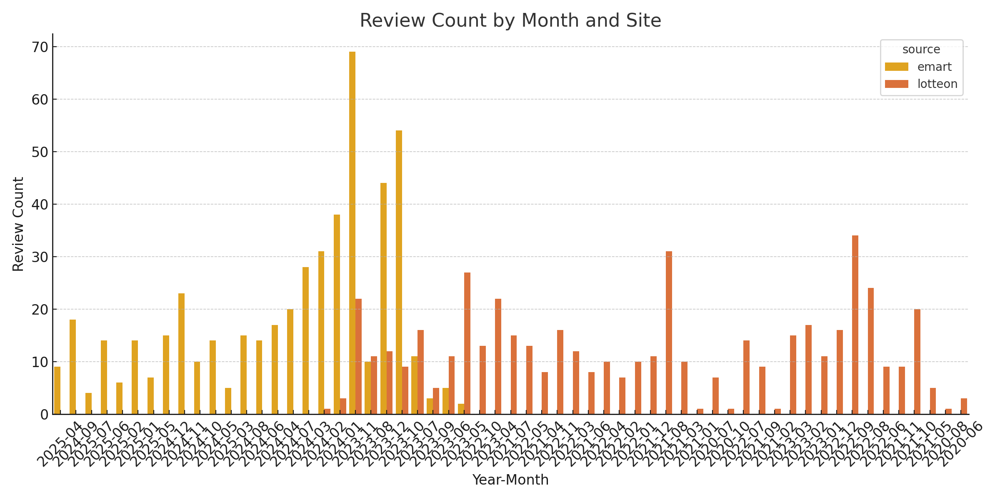

# 1. 크롤링

## LotteON 리뷰 크롤링

### 크롤링 대상 사이트

- [LotteON - 코카콜라 190ml 60캔 상품 페이지](https://www.lotteon.com/p/product/LD755546264)

### 크롤링한 데이터 형식

- 총 500개의 리뷰를 최대 수집하도록 설정되어 있습니다.

리뷰는 스크롤을 통해 로딩되며, 이후 페이지를 넘기며 반복적으로 데이터를 수집합니다.
리뷰 한 건에 포함되는 정보: 날짜, 별점, 리뷰글
이 중 하나라도 누락된 경우 해당 리뷰는 제외되어 저장되지 않습니다.
따라서 최종 저장된 CSV에는 결측치(Null 값)가 존재하지 않습니다. 

- CSV 파일로 저장됨 (`reviews_lotteon.csv`)
저장 경로는 output_dir 인자로 지정한 경로이며, 파일명은 reviews_lotteon.csv입니다.

- 열(column) 구성:
  - `date`: 리뷰 작성일 (문자열)
  - `star`: 별점 (실수형, 1.0 ~ 5.0)
  - `review`: 리뷰 본문 (문자열)

각 리뷰는 다음의 CSS Selector 기반으로 구성되어 있습니다:
날짜: span.date
별점: div.staring > em
리뷰: span.texting

크롤링 실행 예시
#- crawling 디렉토리에서 실행하는 경우

PYTHONPATH=../../ python main.py -c lotteon -o ../../database
 크롤링 중 발생할 수 있는 이슈
LotteON 웹사이트는 동적 로딩 구조이기 때문에, 페이지 로딩이 느리거나 요소 탐색 실패 시 크롤링이 중단될 수 있습니다.

만약 아래와 같은 메시지가 발생한다면 사이트 구조 변경 혹은 일시적인 접속 이슈일 수 있습니다.
리뷰 요소 탐색 실패: …
다음 페이지 이동 실패: …
이 경우 몇 분 후 재시도하거나 **페이지 스크롤 수와 대기 시간(delay)**을 조정해보시기 바랍니다.


## Naver 리뷰 크롤링

### 크롤링 대상 사이트

- [네이버쇼핑 - 코카콜라 190ml 60캔 상품 페이지](https://brand.naver.com/cocacola/products/4624572909)

### 크롤링한 데이터 형식

- 총 500개의 리뷰
  리뷰 한 페이지 당 20개 존재 -> 페이지를 넘기면서 크롤링 하다가 500개가 되는 때에 멈추도록 제한

- CSV 파일로 저장됨 (`reviews_naver.csv`)

- 열(column) 구성:
  - `별점`: 별점 (실수형, 1.0 ~ 5.0) : class "_15NU42F3kT"
  - `날짜`: 리뷰 작성일 (문자열),`리뷰`: 리뷰 본문 (문자열) : class "_2L3vDiadT9" 에 webelement 로 존재 
  -> "_2L3vDiadT9" 에 해당하는 web element를 text화 한 후 날짜 형식 (xx.xx.xx.)을 기준으로 list element 생성하여 index 기준으로 날짜와 리뷰 추출

#- Naver 리뷰 크롤링에서

(fastapi-env) (base) hanjisu@hanjisuui-MacBookAir crawling % PYTHONPATH=../../ python main.py -c naver -o ../../database

1 페이지 크롤링 중...
Traceback (most recent call last):
  File "/Users/hanjisu/Desktop/YBIGTA_newbie_team_project/review_analysis/crawling/main.py", line 34, in <module>
    crawler.scrape_reviews()
  File "/Users/hanjisu/Desktop/YBIGTA_newbie_team_project/review_analysis/crawling/naver_crawler.py", line 64, in scrape_reviews
    first_index = date_indices[0]
                  ~~~~~~~~~~~~^^^
IndexError: list index out of range

  위 에러가 잘 작동하는 동일한 코드파일을 실행하더라도 랜덤으로 발생하는데, 다시 실행하면 잘 작동됩니다. 
  따라서 혹시 위와 같은 에러가 발생한다면 사이트 접근 이슈일 것으로 추정되니 조금 기다렸다가 몇 번 다시 실행해주세요 🥹


## 이마트몰 리뷰 크롤링

### 크롤링 대상 사이트
- []("")

### 크롤링한 데이터 형식


# 2. EDA/FE + 시각화
크롤링한 리뷰 데이터를 바탕으로 Emart, LotteON, Naver 3개 플랫폼에 대해 다음과 같은 흐름으로 데이터 분석 및 전처리를 수행했습니다.

## 개별 분석

1. 데이터 불러오기 및 구조 정리
플랫폼마다 저장 포맷이 달라, CSV 구조를 통일하는 작업이 필요했습니다.
특히 Naver 데이터의 경우 비정상적인 형식과 누락된 정보가 많아, 헤더 통일 및 필드 정제를 우선 수행했습니다.
개별 csv를 전처리 하기 전 단계에서 EDA를 수행할 때 세 파일을 모두 진행하고자 하였으나, naver의 경우 저장 포맷이 나머지 두 사이트와 다르고
리뷰 순서가 추천순으로 기본설정이 되어있는 다른 사이트와 달리 최신순으로 설정이 되어 2021-2025로 분포가 일정하지 않고 2025 06-07월에 밀집되어 부득이하게 전처리 이후에만 분석에 적용하였습니다. 

2. 별점(Rating) 분포 분석 및 확인
전체 데이터를 기준으로 별점 분포를 시각화한 결과, 5점과 4점에 리뷰가 편중된 양상을 보였습니다.
데이터 상에서 1.0-5.0를 벗어나거나 소숫점으로 나타나는 등의 이상치로 보이는 별점은 확인되지 않았습니다.
사이트별 별점 분포 역시 각 사이트에서 유사한 경향을 보였습니다.

### 결측치 및 이상치 처리 

리뷰 텍스트 없음 → "" (빈 문자열)로 처리
날짜 파싱 실패 → NaT 처리
이 부분은 크롤링 단계에서 날짜, 평점, 리뷰를 모두 갖춘 element만 크롤링 하도록 구현하였습니다. 

이후 이상치 처리 과정에서는 
리뷰 길이 200자 이상 → 이상치로 간주, 시각화 통해 확인 후 의미 단위로 글자 수를 초과하는 뒷 부분을 삭제하였습니다.

이러한 과정들을 통해 리뷰 데이터셋을 시각적으로 탐색하고, 의미 없는 정보와 오류 데이터를 제거하여 모델 학습과 분석이 가능한 정제된 리뷰 데이터셋을 구축했습니다.


### 날짜(Date) 분포 및 전처리

(1) 날짜 전처리
다양한 날짜 포맷(예: 23.01.01, 2023-01-01, 2023.1.1.)이 혼재되어 있어, yy-mm-dd 형식으로 통일했습니다.

dt = datetime.strptime(date_str, fmt)
return dt.strftime("%y-%m-%d")
파싱 실패 시 NaT로 처리해 분석 시 제외 가능하게 했습니다.

(2) 월별 리뷰 수 시각화
전체 월별 리뷰 수는 아래와 같으며, 특정 시기에 리뷰가 집중되어 있음을 확인할 수 있습니다.




Emart와 LotteON 별로 보면, Emart는 특정 시점에 집중적으로 리뷰가 작성되었고, LotteON은 비교적 고르게 분포되어 있습니다.


### 텍스트 데이터 전처리 (리뷰 텍스트 정제)

전처리 내용 (clean_review() 기준)

- 줄바꿈 문자 제거: \n, \r 제거
- 특수기호 제거: 정규표현식으로 한글, 영문, 숫자, 문장부호 제외 문자 제거
- 중복 문자 축약: (예) 좋아아아 → 좋아아
- 단독 자음/모음 제거: ㄱ, ㅏ 등 제거
- 공백 정리: strip() 사용
- 텍스트 길이 자르기: truncate_review() 함수로 80~100자 사이로 잘림

- 리뷰 길이 분석 및 이상치 탐지
  전체 리뷰 텍스트의 길이를 박스플롯(Box Plot) 으로 시각화한 결과, 대부분 40~100자 사이에 집중되며, 200자 이상은 이상치로 판단됩니다.


  사이트별로 보면 Emart와 LotteON 모두 유사한 분포를 보입니다.


### 텍스트 벡터화 (feature_engineering(self))

  텍스트 벡터화란, 텍스트(문자열) 데이터를 수치화된 벡터 형태로 변환하는 과정을 의미합니다. 이를 통해 머신러닝 모델이 텍스트를 이해할 수 있습니다.
다양한 텍스트 벡터화 방식 중, 문장 간 단어의 발생 빈도수와 분장 내 단어의 발생 빈도수를 고려하여 단어의 중요도를 반영할 수 있는 TF-IDF 방식을 사용하였습니다. 

  먼저, 기본적인 벡터화 도구로 TfidfVectorizer from sklearn.feature_extraction.text 를 import하여 구현하였습니다. 
띄어쓰기 단위 기준으로 단어를 잘라서 TF-IDF 벡터를 만드는 방식으로 구현했는데, 기본 whitespace tokenizer를 사용하여 형태소 분석 (Okt), 어간 추출, 불용어 제거, 정규화 등의 전처리 과정 없이 단어 그대로 적용됩니다. 

```
from konlpy.tag import Okt
okt = Okt()

    def normalize_korean_text(text):
        if not isinstance(text, str):
            return []
        return okt.morphs(text, stem=True)  # 형태소 분석 + 어간 추출
tokenizer=normalize_korean_text, 
            token_pattern=None
```
  위 코드를 이용하여 어휘 목록에 있는 의미가 겹치는 단어들을 정제하려고 하였으나 패키지 설치가 복잡하여 채점 시 오류를 발생시키는 빈도가 높아 제거했습니다.
이를 적용한다면 형태소를 분석하고 어간만 추출하여 의미적 정확도를 높이고 차원을 줄일 수 있습니다.

 - TF-IDF 방식
  mean_tfidf = tfidf_df.mean().sort_values(ascending=False).head(top_n)
  TF-IDF 점수는 문서별 단어 중요도를 나타내는데, 각 플랫폼별 리뷰 전체에 대해 단어별 평균 TF-IDF를 계산하였습니다. 
이를 이용해 아래 텍스트 비교 분석 파트에서 시각화와 함께 세 플랫폼에서 나타나는 리뷰의 특징을 분석해보았습니다. 


### 파생 변수 생성 (요일(Weekday))

날짜 데이터를 기반으로 리뷰가 작성된 요일을 추출했습니다.

self.df['weekday'] = pd.to_datetime(self.df['date'], format="%y-%m-%d", errors='coerce').dt.day_name()
이는 요일별 사용자 리뷰 패턴 분석에 활용됩니다.


## 비교 분석

### 텍스트 비교 분석


  벡터화된 리뷰 텍스트를 바탕으로 TF-IDF 점수가 높은 상위 20개 단어를 뽑아 각 플랫폼에 대해 수치를 시각화하여 비교해 보았습니다. 
세 플랫폼에서 공통적으로 "좋아요", "잘", "감사합니다", "빠르고", "배송", "항상", "저렴하게", "코카콜라" 등의 단어들이 높은 TF-IDF 점수를 기록하였고,
이에 전반적으로 제품에 대한 긍정적인 평가와 배송 속도에 대한 만족도가 모든 플랫폼에서 높은 수준을 보임을 알 수 있었습니다. 

  아래는 플랫폼 별로 특징적인 단어들에 대한 분석입니다. 

- Naver
상위 키워드에 "빠른배송", "배송이", "딱", "한번에" 등의 합성어 또는 형식적인 표현이 포함되어 있고, 감성 단어로는 "너무", "좋습니다", "있어요" 등 다소 일반적인 표현이 다수를 차지하고 있습니다.  
따라서 형식적인 리뷰나 반복적인 키워드 조합이 많을 것으로 예상합니다. 
또한 배송과 관련된 단어가 다수를 차지하고 있고, '빠른'과 함께 자주 등장하는 것으로 보아 소비자들의 배송에 대한 만족도가 높다고 보여집니다. 

- LotteON
"만족합니다", "가격도", "좋은", "맛있어요" 등의 단어의 수치가 높습니다. 
"배송도빠르고", "가격에" 같이 복합적 만족을 표현하는 구문이 포함되어 있고, 타 사이트에 비해 가격에 대한 언급이 많은 것으로 보아 상대적으로 저렴한 가격에 만족스러운 맛을 제공하여 소비자들의 만족도가 높았음을 알 수 있었습니다. 

- Emart Mall
"항상", "늘", "자주" 등의 단어가 타 사이트에 비해 등장하는 빈도가 높은데, 이는 상대적으로 재구매 의사와 제품 자체에 대한 품질 평가가 많이 언급되었음을 시사합니다. 따라서 Emart mall 유저들은 상품이 만족스러운 경우 재구매율이 높을 것으로 예상됩니다. 
"좋아요", "맛있어요", "만족합니다", "감사합니다", "최고에요" 등 만족을 나타내는 표현이 다양하고 자주 등장하는 것으로 보아 소비자의 만족도가 매우 높은 것으로 예측됩니다. 

### 시계열 비교 분석

1. 월별 리뷰 개수 분석


세 플랫폼의 리뷰 데이터를 기준으로, 월별 리뷰 수(YYYY-MM)를 비교하였습니다.
Naver의 경우, 크롤링 시점이 편향적으로 특정 시점에 몰려 있어 시계열 분석에 활용하기에 부적합하다고 판단하였습니다.
LotteON은 2021년 8월과 2022년 9월에 리뷰 수가 눈에 띄게 증가한 시기가 있으며, 이는 해당 상품의 시즌성 판매 또는 마케팅 이벤트 등으로 인해 계절성을 가질 가능성이 있습니다.
Emart는 2023년 11월에 리뷰 수가 급격히 증가한 것이 확인되었으나, 이 증가 원인은 추가적인 외부 요인 분석이 필요합니다. 전반적으로 Emart와 LotteON의 리뷰는 여러 시점에 걸쳐 분포하고 있어 시계열 분석이 가능합니다.

2. 요일별 리뷰 개수 분석


각 플랫폼의 리뷰 데이터에 대해 요일별 리뷰 작성 개수를 분석하였습니다.
Emart는 화요일, LotteON과 Naver는 수요일에 리뷰가 다소 집중되는 경향이 있었습니다.
그러나 전체적으로는 특정 요일에 뚜렷하게 집중된 경향은 보이지 않았으며, 세 사이트 모두 평균 수준의 고른 분포를 나타냅니다.
이는 ‘콜라’라는 상품이 요일에 따라 구매 패턴이 달라지는 소비재가 아니라, 물과 같이 일상적으로 소비되는 필수재 성격을 갖기 때문일 가능성이 있습니다.

3. 월별 평균 평점 분석


전반적으로 세 플랫폼 모두 높은 평점(4.5-5.0)을 유지하고 있으며, 일부 낮은 평점(1,3점)도 존재하나 빈도는 적었습니다.
특히 LotteON의 경우, 리뷰를 추천순으로 정렬한 상위 500개만 수집했기 때문에, 긍정적인 평가 위주로 편향되어 있을 가능성이 높습니다.
상품 자체가 대체로 특가 상품으로 판매되며, 대량 구매가 잦고 상품에 대한 기대치가 명확한 만큼 평점이 높게 나타나는 경향이 있는 것으로 분석됩니다.

# 3. Git 과제 

## github 설정

### branch_protection.png


### push_rejected.png


### review_and_merged


## 팀원 소개
안녕하세요 저희 팀은 팀장 한지수, 팀원 구남혁, 강예서로 이루어져있습니다. 저희는 키워드를 이용하여 자기소개를 해보았습니다.

한지수(03)
인공지능학과 23학번
\#팀장 \#ENTJ \#DS \#보컬_밴드 
저는 이번 신입 기수 팀프로젝트에서 팀장을 맡고 있으며, mbti는 항상 바뀌지만 NT성향이 강한 것 같습니다. 
DS팀에 들어가고 싶어서 YBIGTA에 지원하였지만, 인공지능 외에 다른 분야도 경험해보고 싶습니다. 
인공지능학과 밴드에서 보컬로 몇 번 공연을 했었는데, 그래서 노래방 가는 걸 매우 좋아하니 언제든 불러주세요!

구남혁(03)
응용통계학과 22학번

\# ESFJ \# DA팀 \#센터백_축구 

강예서(04)
경영학과 23학번

\# ISFP \#DA팀 \#일렉_밴드

## WEB, 크롤링, EDA/FE 과제 실행 방법

### WEB 과제

- fastAPI 앱(서버) 실행
YBIGTA_newbie_team_project directory 기준
uvicorn app.main:app --reload 를 terminal에서 실행한 후
http://127.0.0.1:8000/docs 에 접속하여 기능 구현 여부를 확인하실 수 있습니다.

- index.html 실행
app/static directory 기준
python3 -m http.server 8000 을 terminal에서 실행한 후 
http://localhost:8000/index.html 에 접속하여 디자인 구현 여부를 확인하실 수 있습니다. 


### 크롤링 과제

  ```bash
  특정 크롤러 실행
  YBIGTA_newbie_team_project directory 기준
  PYTHONPATH=. python review_analysis/crawling/main.py -o review_analysis/output --crawler lotteon
  PYTHONPATH=. python review_analysis/crawling/main.py -o review_analysis/output --crawler emart
  PYTHONPATH=. python review_analysis/crawling/main.py -o review_analysis/output --crawler naver

  모든 크롤러 실행 (전체 병합 실행 시)
  YBIGTA_newbie_team_project directory 기준
  PYTHONPATH=. python review_analysis/crawling/main.py -o review_analysis/output --all
  ```
  실행 시 reviews_{crawler_name}.csv 형식의 csv 파일 세 개가 생성됩니다. 
  각 csv 파일은 날짜,별점,리뷰(date, rate, review)로 구성되어 있습니다. 


### 전처리/FE 실행

  ```bash
  review_analysis directory 기준, 
  PYTHONPATH=.. python preprocessing/main.py --all -o ../database
  ```

  를 실행하면 database 폴더에 preprocessed_reviewes_{key}.csv 에 해당하는 csv 파일 세 개와 tfidf_{key}.json 세 개가 생성됩니다. 
  각 csv 파일은 전처리된 날짜, 별점, 리뷰, 요일(date, rate, review, weekday)로 구성되어 있고, json 파일은 벡터화 된 단어들의 tf-idf 점수를 보여줍니다. 